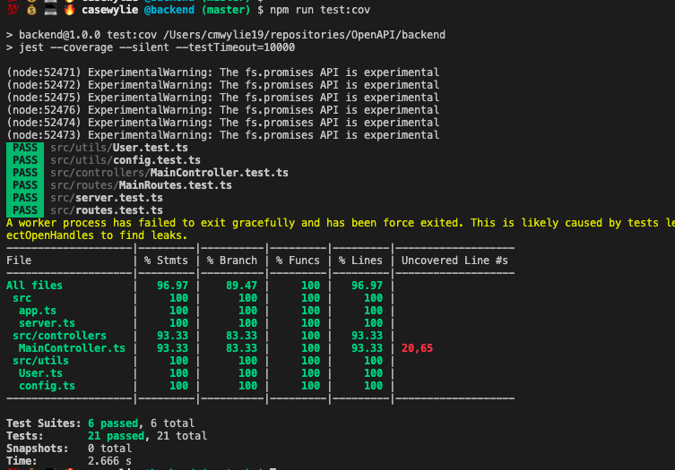

# 360 Enablement

The purpose of this repo is to demo and describe the use cases around some tooling and libraries in the contract first development space. One of the tools that we are going to analyze, hmt, has the ability to proxy actual backend requests and generate a spec based on the proxy logs, which is why we have a simple backend service written in NodeJS. We will also use the NodeJS service top perform fuzz testing with `unmock`


## NodeJS User Service
A dead simple, well tested,, object-oriented implementation of a webserver that can perform CRUD operations on a `user object`. 

Simple rest endpoints
```
POST   /users
GET    /users
GET    /users/:email
PUT    /users/:email
DELETE /users/:email
```

The user object interface
```
enum IUser {
    email: string,
    name: string,
    role: string
}
```
Install the dependencies for the application.
```
npm i 
````

Run the unit tests.
```
npm run test:unit
```


Run the application locallu.
```
npm run dev
```

The postman collection  is the `ApiMockServer.postman_collection.json` file in the root of the repo, import the collection and run the app to start manipulating users.


## fakeit 
[fakeit](https://github.com/JustinFeng/fakeit)

This OpenAPI mock server built with the motivation to control response generation in a non intrusive manner to support development against a contract. 


### Installation
_make sure you are using ruby v2.7.1, if you have rvm use `rvm install 2.7.1` first_
```
gem install fakeit
```

### Features
- ran return random responses
- can return object type defs
- can return example responses

Now would be a good time to import the postman collection into postman and follow along but you can also follow along with `curl`.
#### Return Type Defs
We are going to run faker, supply the --spec argument for the OpenAPI spec file, -p to run the mock server on port 3333 and --static to return static responses
```
fakeit --spec openapi.yml -p 3333 --static       
```
Now in a different terminal hit the `GET` /users with a curl
```
curl -G http://localhost:3333/users
```
and `fakeit` will return the type definition of the `user` object.

```
{
    "name": "string",
    "role": "string"
}
```
#### Return Random Reponses
The next way we are going to use `fakeit` is to return random responses, start fakeit from the terminal, --spec openapi.yml, -p 3333, --static-types
```
fakeit --spec openapi.yml -p 3333 --static-types
```
Your mock api server will now return random values of the given type specified in the OpenAPI spec.

```
curl -G http://localhost:3333/users
```
and `fakeit` will return a random string for name and a random string for role.

```
{
    "name": "Things Fall Apart",
    "role": "Dulce et Decorum Est"
}
```
#### Return Example Responses
In the event you want fakeit to return the example responses defined in the OpenAPI spec you can specify the `--use-example`
```
fakeit --spec openapi.yml -p 3333 --use-example
```
In another terminal
```
curl -G http://localhost:3333/users
```
and `fakeit` will return the example specified in the response of the spec

```
{
    "name": "Test User",
    "role": "Role"
}
```


## apisprout

OpenAPI 3 mock server written in golang. apisproute returns _only the example responses defined in the OpenAPI spec_.

### Features
- health check
- log req.hostname

### Installation
_make sure you have golang in your path_
```
go get github.com/danielgtaylor/apisprout
```

#### Return Example Responses
Start apisprout mock server listening on port 3333 and return example responses defined in the OpenAPI spec.
```
./apisproute -p 3333 openapi.yml

```
in another terminal 
```
curl -G http://localhost:3333/users/test@user.com
```
results in the following response 
```
{
    "name": "Test User",
    "role": "test"
}
```

now lets check the health of the mock server, you can expect a 200 response. 
```
curl -G http://localhost:3333/users/__health
```

## openapi-mock 
[openapi-mock github](https://github.com/penx/openapi-mock)

This tool is another mock server that generates random data. 

### Usage
This tool does not have any extra features other than serving mock data based on the OAS.
```
./openapi-mock --specification-url openapi.yml
```
Now in a different terminal hit the `GET` /users with a curl
```
curl -G http://localhost:8000/users
```


## HMT

Http Mocking Toolkit (HMT). Tool that mocks HTTP APIs for use in sandboxes as well as automated and explatoratory testing. It uses a combo of API definitions, recorded traffic and code in order to make crafting mocks as enjoyable as possible. _Provides a quick way to get up and running from an existing backend_

### Features
- create mocks of APIs from server traffic and OpenAPI specs.


### Installation
_make sure you have python in your path_
```
pip install hmt (Python 3.6+)
OR
brew tap meeshkan/tap
brew install hmt
```
##### Usage

    $ hmt --help

Command line options:

    $ fakeit --help
    usage:
        --spec               spec file uri (required)
        -p, --port           custom port
        -q, --quiet          mute request and response log
        --permissive         log validation error as warning instead of denying request
        --use-example        use example provided in spec if exists
        --static             generate static response
        --static-types       generate static value for specified types, e.g. --static-types integer,string
        --static-properties  generate static value for specified properties, e.g. --static-properties id,uuid

    other options:
        -v, --version
        -h, --help

    example:
    In 3 different terminals
    terminal 1: $ sudo hmt record
    terminal 2: $ npm run dev
    terminal 3: $ wget http://localhost:8000/http://localhost:3333/users/casewylie@gmail.com
    terminal 3: wget http://localhost:8000/http://localhost:3333/users/cwylie@redhat.com

    $ hmt build logs/localhost\:3333-recordings.jsonl --mode gen
    $ sudo hmt mock openapi.yml

## unmock

Testing library for JavaScript. Fuzz test your rest calls. It works similar to the mock api servers that serve random data.
```
fuzz test - a form of testing where you verify the correctness of code by asserting that it behaves correctly with variable and unexpected input.
```

### Features
- Integrates well with Jest, Mocka, Jasmine, Tap and Ava
- provides a way to override rest endpoints to provide variable and optional responses in additional to different status codes.


### Installation
```
npm i --save-dev unmock
```

