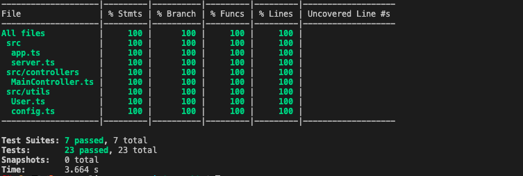

# Overview

The purpose of this repo is to demonstrate how to use several of the tools in the OpenAPI mock server space. One of the tools that we are going to analyze, hmt, has the ability to proxy actual backend requests and generate a spec based on the proxy logs, which is why we have a simple backend service written in NodeJS.

## NodeJS User Service

This is a simple, well tested, object oriented, typed NodeJS server with the following endpoints:
```
POST   /users
GET    /users
GET    /users/:email
PUT    /users/:email
DELETE /users/:email
```

## Get started
```
npm i 
npm run dev
npm run test:cov
```



## Tools under review

- fakeit
- api-sprout
- unmock
- prism

## fakeit

OpenAPI mock built with the motivation to control response generation in a non intrusive manner to support development against a contract.

##### Features
- radnom or static responses
- request validation for json and mutlipart/form-data responses


##### Installation
_make sure you are using ruby v2.7.1, if you have rvm use `rvm install 2.7.1` first_
```
gem install fakeit
```

##### Usage

    $ fakeit --spec <Local file or remote url>

Command line options:

    $ fakeit --help
    usage:
        --spec               spec file uri (required)
        -p, --port           custom port
        -q, --quiet          mute request and response log
        --permissive         log validation error as warning instead of denying request
        --use-example        use example provided in spec if exists
        --static             generate static response
        --static-types       generate static value for specified types, e.g. --static-types integer,string
        --static-properties  generate static value for specified properties, e.g. --static-properties id,uuid

    other options:
        -v, --version
        -h, --help

    example:
    $ fakeit --spec openapi.yml -p 3333 --static
    $ fakeit --spec openapi.yml -p 3333 --static-types

## apisprout

Lightweight, blazing fast, cross-platform OpenAPI 3 mock server with Validation written in golang

### Features
- request validation for json and mutlipart/form-data responses
- health check


### Installation
_make sure you have golang in your path_
```
go get github.com/danielgtaylor/apisprout
```

### Usage

    $ ./apisproute <Local file or remote url>
Usage:
  apisprout [flags] FILE

Examples:
  ##### Basic usage
  apisprout openapi.yaml

  ##### Validate server name and use base path
  apisprout --validate-server openapi.yaml

  ##### Fetch API via HTTP with custom auth header
  apisprout -H 'Authorization: abc123' http://example.com/openapi.yaml

Flags:
 

Command line options:

    $ apisprout --help
    usage:
        --add-server string   Add a new valid server URL, use with --validate-server
        --disable-cors        Disable CORS headers
        -H, --header string       Add a custom header when fetching API
        -h, --help                help for apisprout
        -p, --port int            HTTP port (default 8000)
            --validate-request    Check request data structure
        -s, --validate-server     Check scheme/hostname/basepath 
        -w, --watch               Reload when input file changes

    example:
    $ ./apisprout -s openapi.yml
    $ ./apisprout openapi.yml -p 3333
    $ curl -G http://localhost:3333/users/__health

## HMT

Http Mocking Toolkit (HMT). Tool that mocks HTTP APIs for use in sandboxes as well as automated and explatoratory testing. It uses a combo of API definitions, recorded traffic and code in order to make crafting mocks as enjoyable as possible. _Provides a quick way to get up and running from an existing backend_

### Features
- create mocks of APIs from server traffic and OpenAPI specs.


### Installation
_make sure you have python in your path_
```
pip install hmt (Python 3.6+)
OR
brew tap meeshkan/tap
brew install hmt
```
##### Usage

    $ hmt --help

Command line options:

    $ fakeit --help
    usage:
        --spec               spec file uri (required)
        -p, --port           custom port
        -q, --quiet          mute request and response log
        --permissive         log validation error as warning instead of denying request
        --use-example        use example provided in spec if exists
        --static             generate static response
        --static-types       generate static value for specified types, e.g. --static-types integer,string
        --static-properties  generate static value for specified properties, e.g. --static-properties id,uuid

    other options:
        -v, --version
        -h, --help

    example:
    In 3 different terminals
    terminal 1: $ sudo hmt record
    terminal 2: $ npm run dev
    terminal 3: $ wget http://localhost:8000/http://localhost:3333/users/casewylie@gmail.com
    terminal 3: wget http://localhost:8000/http://localhost:3333/users/cwylie@redhat.com

    $ hmt build logs/localhost\:3333-recordings.jsonl --mode gen
    $ sudo hmt mock openapi.yml

## unmock

Testing library for JavaScript. Fuzz test your rest calls. This is a node module for testing inside your project. Similar to a typical mock server but it does not need to be started from outside of the project
```
fuzz test - a form of testing where you verify the correctness of code by asserting that it behaves correctly with variable and unexpected input.
```

### Features
- Integrates well with Jest, Mocka, Jasmine, Tap and Ava
- provides a way to override rest endpoints to provide variable and optional responses in additional to different status codes.


### Installation
```
npm i --save-dev unmock
```
##### Usage

    $ hmt --help

Command line options:

    $ fakeit --help
    usage:
        --spec               spec file uri (required)
        -p, --port           custom port
        -q, --quiet          mute request and response log
        --permissive         log validation error as warning instead of denying request
        --use-example        use example provided in spec if exists
        --static             generate static response
        --static-types       generate static value for specified types, e.g. --static-types integer,string
        --static-properties  generate static value for specified properties, e.g. --static-properties id,uuid

    other options:
        -v, --version
        -h, --help

    example:
    In 3 different terminals
    terminal 1: $ sudo hmt record
    terminal 2: $ npm run dev
    terminal 3: $ wget http://localhost:8000/http://localhost:3333/users/casewylie@gmail.com
    terminal 3: wget http://localhost:8000/http://localhost:3333/users/cwylie@redhat.com

    $ hmt build logs/localhost\:3333-recordings.jsonl --mode gen
    $ sudo hmt mock openapi.yml

